# Architecture Diagrams

Visual reference for the Security Agent Mesh architecture. All diagrams use [Mermaid](https://mermaid.js.org/) syntax and render natively in GitHub, GitLab, Notion, and most Markdown viewers.

---

## Table of Contents

- [High-Level Architecture](#high-level-architecture)
- [Agent Mesh Topology](#agent-mesh-topology)
- [Request Routing Flow](#request-routing-flow)
- [Alert-Triggered Investigation Flow](#alert-triggered-investigation-flow)
- [Investigation Context Lifecycle](#investigation-context-lifecycle)
- [Governance Decision Flow](#governance-decision-flow)
- [Feedback Loops](#feedback-loops)
- [Detection Engineering Agent Toolchain](#detection-engineering-agent-toolchain)
- [Knowledge Base Architecture](#knowledge-base-architecture)
- [Index Relationships](#index-relationships)
- [Deployment Pipeline](#deployment-pipeline)

---

## High-Level Architecture

The six layers of the mesh, from user-facing to infrastructure.

```mermaid
graph TB
    subgraph "Layer 1 — Orchestrator"
        ORCH[Orchestrator Agent]
    end

    subgraph "Layer 2 — Specialist Agents"
        DE[Detection Engineering]
        TI[Threat Intelligence]
        L1[L1 Triage Analyst]
        L2[L2 Investigation Analyst]
        FO[Forensics]
        CO[Compliance]
        SO[SOC Operations]
    end

    subgraph "Layer 3 — Shared Tool Workflows"
        ENR[Enrichment<br/>IP, Hash, Domain]
        SRC[Search<br/>Semantic, Web]
        CAS[Cases<br/>Create, Update]
        VT[VirusTotal<br/>Hash, IP, URL, Domain]
        ALR[Alerts<br/>Query, Tag]
        GOV[Governance<br/>Check, Approve, Log]
        INV[Investigation<br/>Create, Evidence, Status]
    end

    subgraph "Layer 4 — Knowledge Management"
        KB["kb-* indices<br/>(11 domain-specific knowledge bases)"]
    end

    subgraph "Layer 5 — Investigation Context"
        IC[investigation-contexts index]
    end

    subgraph "Layer 6 — Governance Framework"
        AP[action-policies index]
    end

    subgraph "Feedback Loops"
        FL1[Detection Quality]
        FL2[Noisy Rules]
        FL3[Incident Learning]
    end

    ORCH -->|semantic routing| DE & TI & L1 & L2 & FO & CO & SO
    DE & TI & L1 & L2 & FO & CO & SO --> ENR & SRC & CAS & VT & ALR & GOV & INV
    DE & TI & L1 & L2 & FO & CO & SO --> KB
    INV --> IC
    GOV --> AP
    FL1 & FL2 --> KB
    FL3 --> KB & IC

    style ORCH fill:#0077CC,color:#fff
    style DE fill:#00BFB3,color:#fff
    style TI fill:#00BFB3,color:#fff
    style L1 fill:#00BFB3,color:#fff
    style L2 fill:#00BFB3,color:#fff
    style FO fill:#00BFB3,color:#fff
    style CO fill:#00BFB3,color:#fff
    style SO fill:#00BFB3,color:#fff
    style IC fill:#F04E98,color:#fff
    style AP fill:#F04E98,color:#fff
    style KB fill:#FEC514,color:#000
```

---

## Agent Mesh Topology

How agents discover and invoke each other. Solid lines are direct invocations; dashed lines are semantic discovery via the registry.

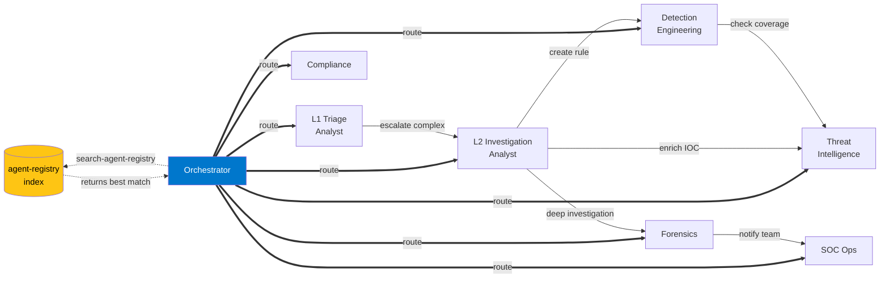

---

## Request Routing Flow

Three entry patterns into the mesh: user requests, alert triggers, and agent-to-agent handoffs.

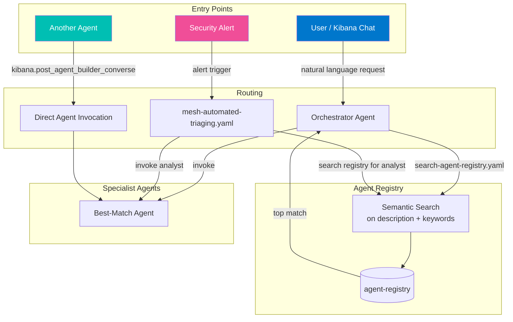

---

## Alert-Triggered Investigation Flow

End-to-end flow from a security alert through triage, investigation, governance, case creation, and feedback.

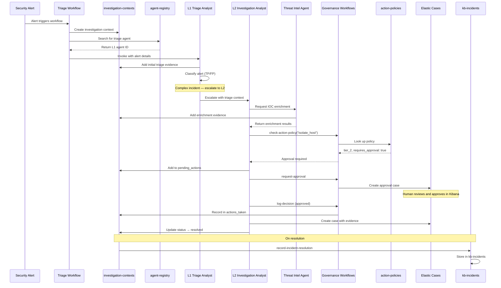

---

## Investigation Context Lifecycle

State transitions and which agents/workflows interact at each stage.

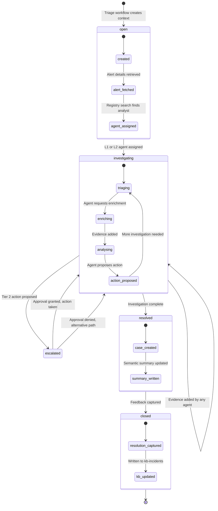

---

## Governance Decision Flow

How agents check and execute actions through the governance framework.

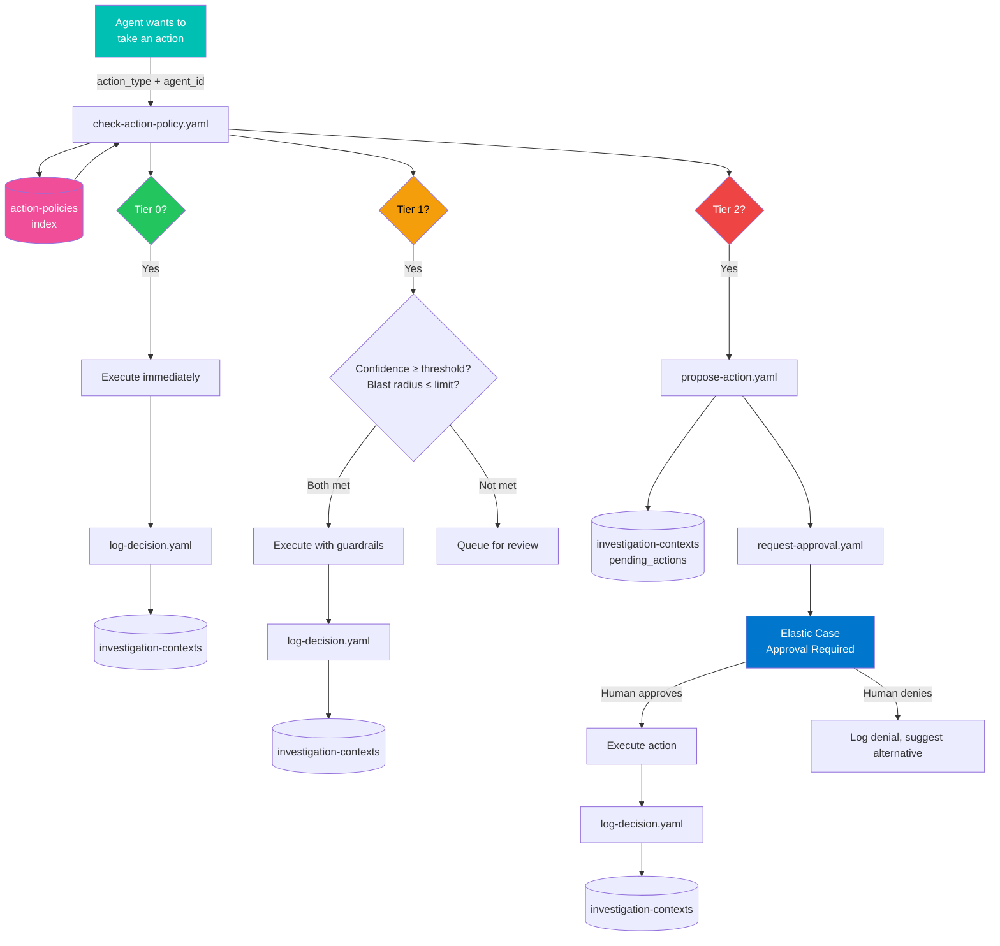

---

## Feedback Loops

Three automated loops that make the system self-improving.

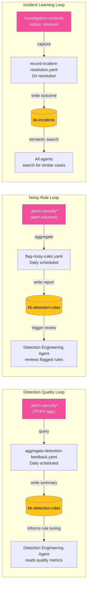

---

## Detection Engineering Agent Toolchain

All tools available to the Detection Engineering Agent and how they connect.

```mermaid
flowchart TD
    DE[Detection Engineering Agent]

    subgraph "Detection Rule Lifecycle"
        LIST["list-detection-rules.yaml<br/>Browse existing rules"]
        GET["get-rule-details.yaml<br/>Full rule inspection"]
        CREATE["create-detection-rule.yaml<br/>Draft new rule — disabled"]
        TOGGLE["enable-disable-rule.yaml<br/>Toggle rule state"]
    end

    subgraph "Coverage Analysis"
        MITRE["evaluate-mitre-coverage.yaml<br/>Gap analysis vs ATT&CK"]
        SEARCH_T["search-rules-by-technique.yaml<br/>Find rules for a technique"]
        FIELD["check-field-availability.yaml<br/>Verify ECS fields in data"]
    end

    subgraph "Knowledge & Context"
        KBS["semantic-knowledge-search.yaml<br/>Search kb-detection-rules,<br/>kb-mitre-attack, kb-ecs-schema"]
        CINV["create-investigation.yaml<br/>Start investigation context"]
        AEVD["add-evidence.yaml<br/>Record findings"]
    end

    subgraph "Governance"
        CPOL["check-action-policy.yaml<br/>Verify action tier"]
    end

    subgraph "Kibana Detection Engine API"
        KAPI["/api/detection_engine/rules"]
    end

    subgraph "Elasticsearch"
        LOGS["logs-* indices"]
        KBIDX["kb-* indices"]
        ICIDX["investigation-contexts"]
    end

    DE --> LIST
    DE --> GET
    DE --> CREATE
    DE --> TOGGLE
    DE --> MITRE
    DE --> SEARCH_T
    DE --> FIELD
    DE --> KBS
    DE --> CINV
    DE --> AEVD
    DE --> CPOL

    LIST --> KAPI
    GET --> KAPI
    CREATE --> KAPI
    TOGGLE --> KAPI

    FIELD --> LOGS
    KBS --> KBIDX
    CINV --> ICIDX
    AEVD --> ICIDX
    MITRE --> KAPI
    MITRE --> KBIDX

    style DE fill:#00BFB3,color:#fff
    style KAPI fill:#0077CC,color:#fff
    style CPOL fill:#EF4444,color:#fff
```

---

## Knowledge Base Architecture

How knowledge bases are structured, accessed, and updated.

```mermaid
flowchart TD
    subgraph "Agents (Consumers & Producers)"
        DE[Detection Engineering]
        TI[Threat Intelligence]
        L1[L1 Triage Analyst]
        L2[L2 Investigation Analyst]
        FO[Forensics]
        CO[Compliance]
        SO[SOC Operations]
    end

    subgraph "Access Pattern"
        SEARCH[semantic-knowledge-search.yaml<br/>Parameterised by index_name]
        ADD[add-knowledge-document.yaml]
        UPD[update-knowledge-document.yaml]
        REM[remove-knowledge-document.yaml]
        STALE[check-knowledge-staleness.yaml]
    end

    subgraph "Knowledge Bases (Elasticsearch)"
        KB_DR[(kb-detection-rules)]
        KB_ECS[(kb-ecs-schema)]
        KB_MITRE[(kb-mitre-attack)]
        KB_TI[(kb-threat-intel)]
        KB_IOC[(kb-ioc-history)]
        KB_INC[(kb-incidents)]
        KB_PB[(kb-playbooks)]
        KB_FOR[(kb-forensics)]
        KB_COMP[(kb-compliance)]
        KB_OPS[(kb-soc-ops)]
        KB_RUN[(kb-runbooks)]
    end

    subgraph "Feedback Loops (Writers)"
        FL1[aggregate-detection-feedback]
        FL2[flag-noisy-rules]
        FL3[record-incident-resolution]
    end

    subgraph "Inference"
        E5["multilingual-e5-small<br/>inference endpoint"]
    end

    DE & TI & L1 & L2 & FO & CO & SO --> SEARCH & ADD & UPD
    SEARCH --> KB_DR & KB_ECS & KB_MITRE & KB_TI & KB_IOC & KB_INC & KB_PB & KB_FOR & KB_COMP & KB_OPS & KB_RUN
    ADD & UPD --> KB_DR & KB_ECS & KB_MITRE & KB_TI & KB_IOC & KB_INC & KB_PB & KB_FOR & KB_COMP & KB_OPS & KB_RUN

    FL1 --> KB_DR
    FL2 --> KB_DR
    FL3 --> KB_INC

    KB_DR & KB_ECS & KB_MITRE & KB_TI & KB_IOC & KB_INC & KB_PB & KB_FOR & KB_COMP & KB_OPS & KB_RUN ---|"semantic_summary field"| E5

    style E5 fill:#0077CC,color:#fff
    style SEARCH fill:#00BFB3,color:#fff
```

---

## Index Relationships

All Elasticsearch indices in the mesh and how they connect.

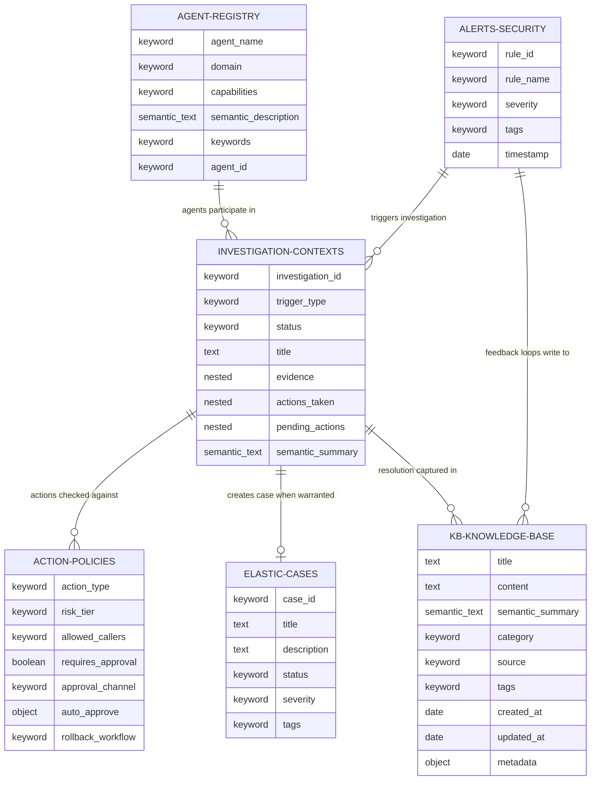

---

## Deployment Pipeline

How the repository is deployed to an Elastic Cloud environment.

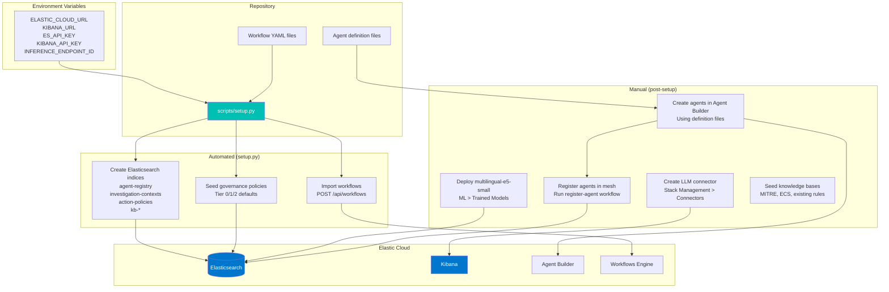
